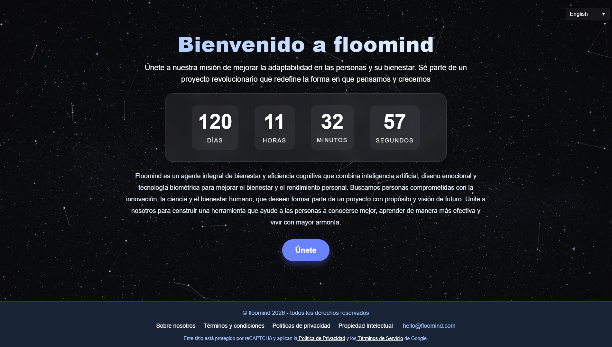
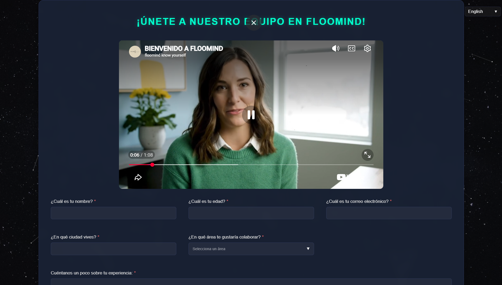
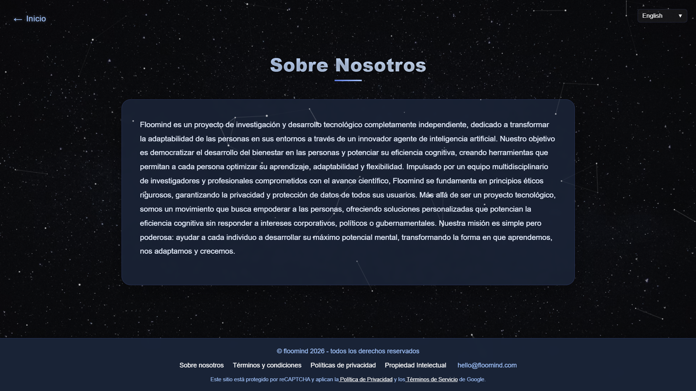

<div align="center">

# 🌌 Floomind — Landing de Reclutamiento

### Sitio de captación de talento para el proyecto Floomind

_Landing multiidioma (10 idiomas) con cuenta regresiva, video de bienvenida, formulario de postulación con filtrado de bots y un flujo de emails que acompaña al candidato por cada fase del proceso de selección._

<br/>

🔗 **En vivo:** [www.floomind.com](https://www.floomind.com)

<br/>


</div>

---

## 📋 Descripción

Landing page del proyecto Floomind orientada a **reclutar talento** para sumarse al equipo. Combina una narrativa de misión (bienestar y eficiencia cognitiva con IA), una cuenta regresiva que genera urgencia, un video de presentación y un formulario de postulación —accesible en **10 idiomas**— que da inicio a un proceso de selección guiado por email.

---

## 🙋 Mi rol en el proyecto

Este proyecto es un **caso de diseño y producto**. Mi aporte fue la concepción y el diseño; la implementación del código estuvo a cargo de un desarrollador.

- 🎨 **Diseño de la interfaz (UI/UX).** Dirección visual, identidad, animaciones y experiencia de navegación del sitio.
- 🧭 **Lógica del sitio de reclutamiento.** Definición del recorrido del candidato: del mensaje de misión al formulario de postulación.
- 📝 **Contenido.** Redacción y curaduría de toda la información relevante (misión, "Sobre Nosotros", copys, llamadas a la acción).
- 🌐 **Alcance internacional.** Definición del sitio como experiencia **multiidioma (10 idiomas)** en todas sus interacciones con el usuario.
- 📧 **Arquitectura del flujo de emails.** Diseño del sistema de correos que interactúa con los candidatos comunicándoles el avance por cada **fase del proceso de selección**.

> El desarrollo (código) fue ejecutado por un tercero a partir de este diseño y esta lógica.

---

## 📸 Capturas

<div align="center">



_Hero: mensaje de misión, cuenta regresiva y llamada a la acción «Únete»._

<br/>



_Sección «Únete a nuestro equipo»: video de bienvenida + formulario de postulación (nombre, edad, email, ciudad, área de interés y experiencia) con reCAPTCHA._

<br/>



_Sección «Sobre Nosotros»: relato del proyecto, misión y principios._

</div>

---

## ✨ Características de la landing

- 🌐 **Multiidioma — 10 idiomas.** Todas las interacciones con el usuario (contenido, formulario y comunicaciones) están disponibles en 10 idiomas, con selector de idioma: **Español, Inglés, Portugués, Francés, Alemán, Ruso, Árabe, Chino, Hindi y Bengalí**.
- 🛡️ **Filtrado de bots con reCAPTCHA.** El formulario de postulación está programado con Google reCAPTCHA para bloquear bots y envíos automatizados.
- ⏳ **Cuenta regresiva** en tiempo real (días / horas / minutos / segundos) hacia un hito del proyecto.
- 🎬 **Video de bienvenida** integrado en la sección de reclutamiento.
- 🧾 **Formulario de postulación** con campos validados (nombre, edad, email, ciudad, área de colaboración y experiencia).
- 🎇 **Fondo animado** de cielo estrellado / constelaciones que refuerza la identidad de marca.
- 📄 **Páginas legales**: Sobre Nosotros, Términos y Condiciones, Políticas de Privacidad, Propiedad Intelectual.

---

## 📧 Flujo de emails del proceso de selección (diseño)

Diseñé el sistema de comunicaciones automáticas que acompaña al candidato desde la postulación hasta el resultado, manteniéndolo informado en cada fase:

```
Postulación enviada
        │
        ▼
  ✉️  Confirmación de recepción
        │
        ▼
  ✉️  Aviso de avance de fase  ─►  (se repite por cada etapa del proceso)
        │
        ▼
  ✉️  Resultado / próximos pasos
```

Cada correo comunica el estado del candidato en el embudo de selección, con un tono alineado a la identidad de Floomind.

---

## 🛠️ Stack del sitio

Construido en **React** (JavaScript), con **Google reCAPTCHA** para el filtrado de bots del formulario, soporte **multiidioma (10 idiomas)** y desplegado sobre hosting propio con HTTPS.

> _Nota: este repositorio es una **vitrina de diseño y producto**. Presenta mi contribución al proyecto mediante capturas y documentación; el código fuente pertenece al proyecto Floomind._

---

## 👤 Autor

**Agustín Formica** — Diseño de producto, UX, contenido y arquitectura del flujo de reclutamiento.

[](mailto:agustin.formica@gmail.com)
[](https://www.linkedin.com/in/agustín-formica)

